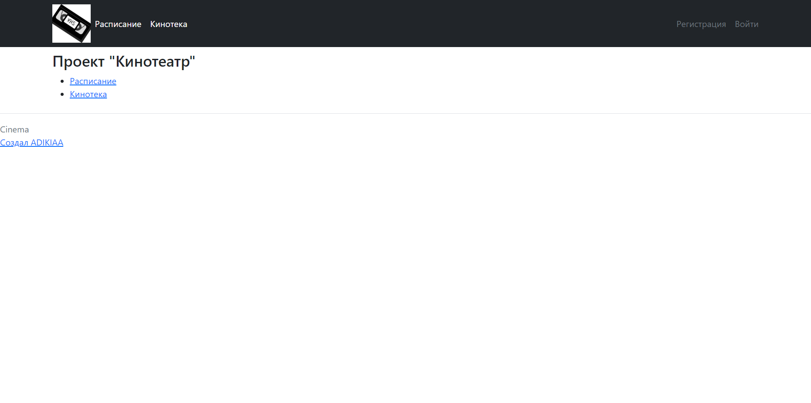
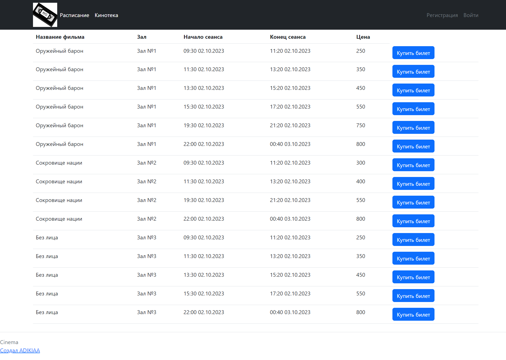
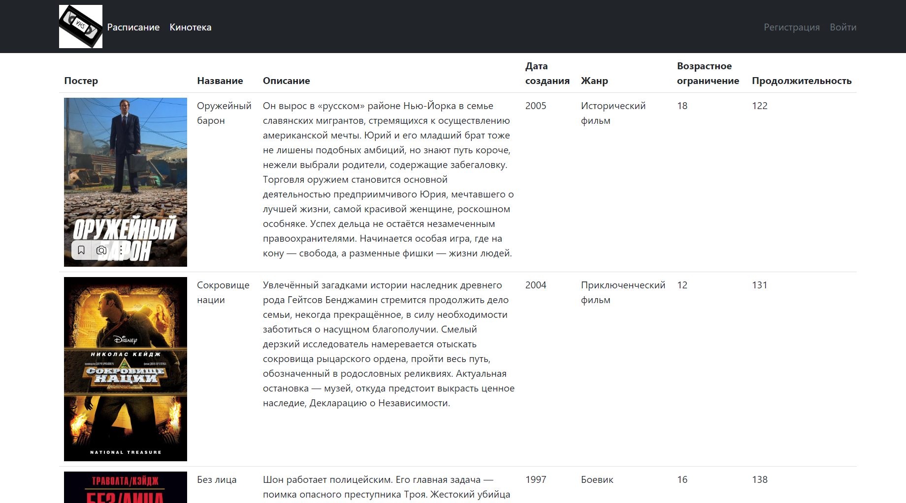
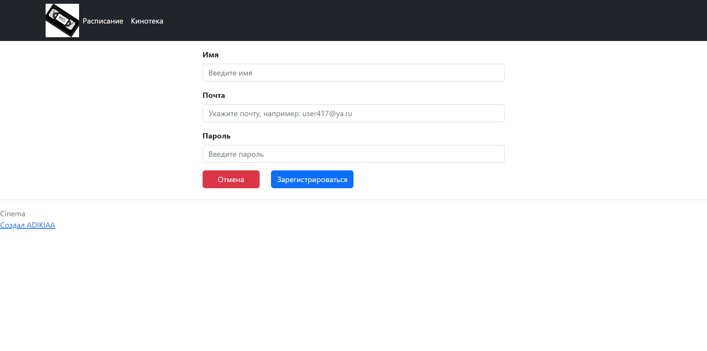
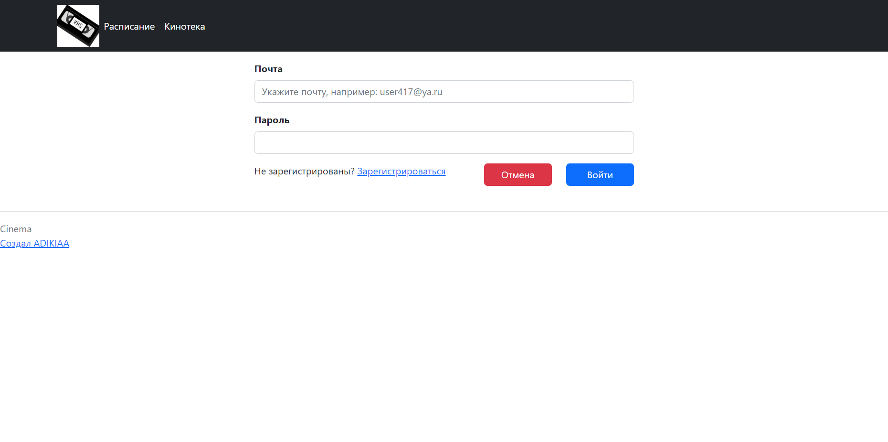
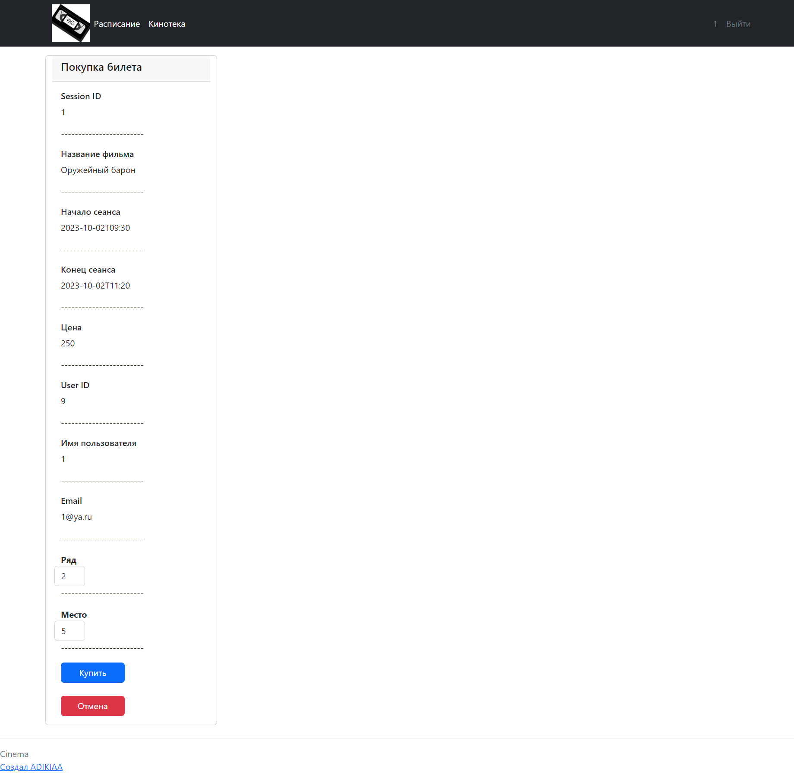
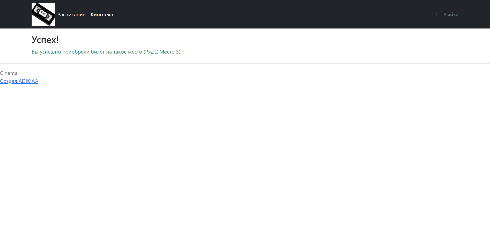
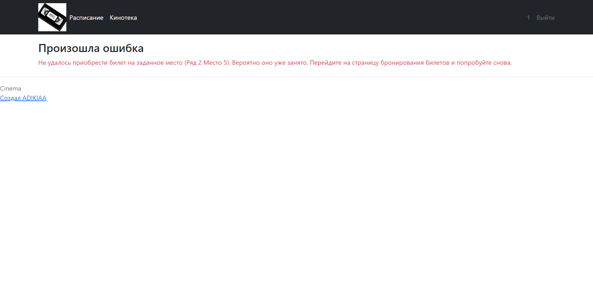

Проект "Кинотеатр" job4j_cinema
---

>Это веб приложение реализует CRUD-систему с использованием MVC шаблона.

## Содержание

---

- [Обшая инофмация](#Общая-информация)
- [Технологии](#Технологии)
- [Скриншоты](#Скриншоты)
- [Контакты](#Контакты)

## Общая информация

---

Проект представляет собой сайт по покупке билетов в кинотеатр.
Все пользователи могут просматривать информацию о фильмах и сеансах на сайте.
Только зарегистрированные пользователи могут покупать билеты.
При попытке купить билет незарегистрированный пользователь будет переброшен на страницу входа.

## Технологии

---

- Java 17
- Database:
  - PostgreSQL 14
  - H2
- JDBC
- Liquibase
- Sql2o
- Apache TomCat
- HTML, Thymeleaf, Bootstrap
- Junit, Mockito
- Maven

## Запуск проекта

---

```
create database cinema;
```
```
mvn compile;
```

## Скриншоты

---

#### Главная страница

#### Страница Сеансов

#### Страница Кинотеки

#### Страница Регистрации

#### Страница Авторизации

#### Страница Покупки билета

#### Страниа Удачной покупки билета

#### Страниа Ошибки


## Контакты

https://github.com/ADIKIAA

---


